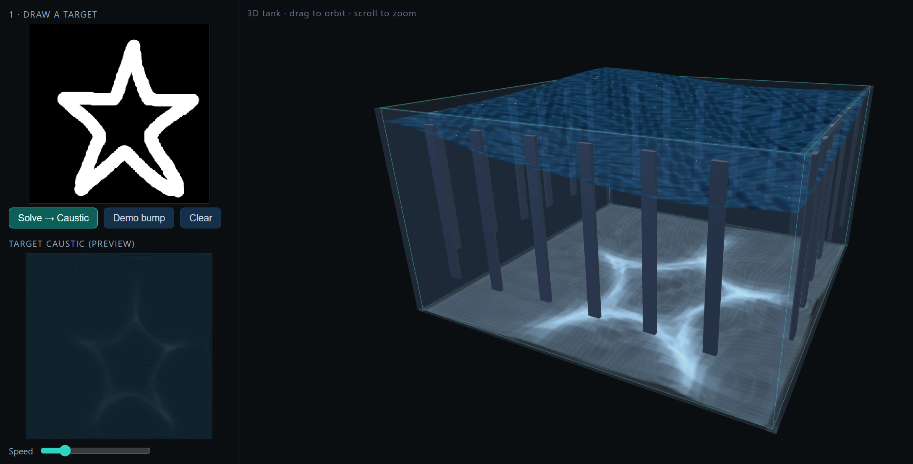

# Dynamic Fluid Caustics

Draw a shape, and watch water focus light into it.



You know the wobbly bright pattern at the bottom of a swimming pool? That's a caustic:
light bent by the water surface. This project runs that backwards. You sketch a target
picture, and the software works out what the water surface would have to look like to
cast that picture on the tank floor, figures out how the wall pistons need to move to
build that surface, simulates the waves, and renders the caustic that comes
out. You get a 2D view and an orbitable 3D tank.

It's written in TypeScript with WebGPU for the physics and caustic, and Three.js for
the 3D tank. Vite builds it, Vitest tests it.

## What actually happens when you press Solve

1. You draw a target on the canvas.
2. The solver finds the water surface that would refract light into that target. This
   is a nonlinear Monge-Ampère solve (a few fixed-point iterations, each a fast DCT
   Poisson step), which handles sharper, higher-contrast drawings than a plain
   linear solve.
3. It converts that surface into a per-piston, time-reversed motion schedule using a
   precomputed inverse of the tank's wave response.
4. It simulates the shallow-water waves those pistons produce.
5. At the focal moment the wavefronts converge, the caustic snaps into your drawing,
   and then the whole thing pulses again.

The 3D tank shows the same physics you can look at from any angle: glass walls,
wavemaker paddles around the rim that move on the computed schedule, a rippling water
surface, and the live caustic on the floor.

If you want the math behind all of this, [`HOW_IT_WORKS.md`](./HOW_IT_WORKS.md) is a
full walkthrough.

## Running it

```bash
npm install
npm run dev      # opens http://localhost:5173
```

You need a browser with WebGPU (Chrome or Edge 113+, or Firefox/Safari with the WebGPU
flag turned on). The 3D tank runs on WebGL and works anywhere.

## Checking it

```bash
npm run typecheck   # tsc, no emit
npm run test        # vitest: solver, actuation, and closed-loop tests
npm run build       # type-check plus production bundle
```

The numerics are tested against CPU reference implementations (and the NumPy prototypes
in `prototypes/`), so the whole draw-to-caustic loop is verified without a GPU. You can
run the test suite on any machine.

## Where things live

Each step is its own small module, and they only talk to each other through typed
payloads defined in `src/contracts`.

```
src/
  contracts/    the typed payloads that define module boundaries
  physics.ts    shared wave math and CFL stability (no framework, unit-tested)
  playback_timing.ts   shared clock so the 2D and 3D views stay in sync
  gpu/          WebGPU device setup, ping-pong textures, pipeline helpers
  modules/
    m1_canvas/       drawing canvas to greyscale target
    m2_density/      blur and band-limit into a positive density map
    m3_inverse/      the inverse-caustic solver (nonlinear Monge-Ampère over a DCT Poisson step)
    m4_actuation/    wave-basis pseudoinverse to a piston schedule (shipped as a binary asset)
    m5_fluid/        forward wave sim (WGSL) plus a CPU reference
    m6_render/       caustic render: normals, refraction splat, tone map
    m7_orchestrator/ the pulse/hold/loop state machine and frame loop
    m8_stage3d/      the 3D tank in Three.js: water, paddles, floor caustic, camera
prototypes/     NumPy references used to check the solvers
```

## A few decisions worth knowing about

The caustic is drawn by splatting points with additive blending rather than an atomic
scatter. WGSL has no float or texture atomics, so the textbook approach doesn't port,
and additive blending gets you the same accumulation without a race.

The sim refuses to start if the timestep breaks the CFL bound. An explicit leapfrog
integrator blows up when the step is too big, so it's better to fail loudly at startup
than to render garbage.

The walls reflect. Neighbour reads are clamped at the grid edge, which gives a
zero-gradient boundary and makes waves bounce off the glass instead of leaking out.

There's one injection rule shared by the actuation math, the GPU sim, and the CPU
reference: step the wave equation, then add each piston's amplitude into the new
surface. Because all three agree exactly, a solved schedule replays back to the target
to machine precision, which is what the closed-loop test checks.

The 3D tank runs the sim on the CPU. Reusing the small CPU wave reference avoids
bridging WebGPU and WebGL, and it hands height values straight to the Three.js mesh.
The floor caustic is recomputed on the CPU too, because a WebGPU canvas can't be read
back as a WebGL texture.

## License

See the repository settings.
